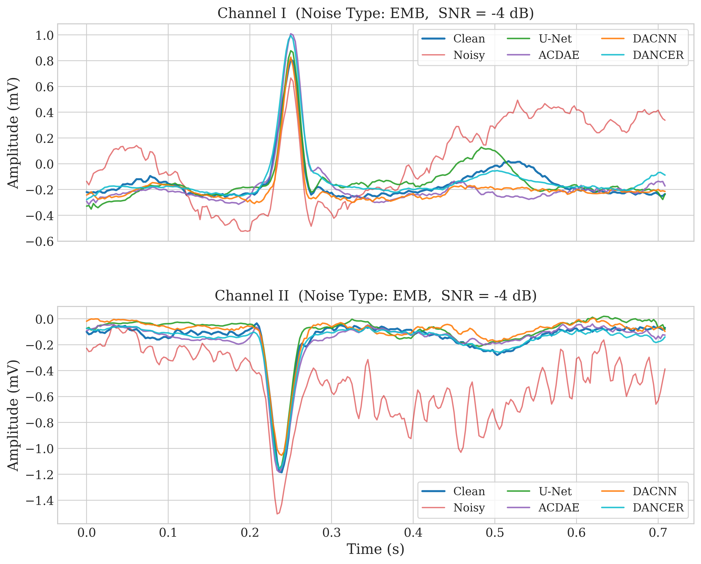

# DANCE: Dual Adaptive Noise-Cancellation and Enhancement for ECG Signals

## 网络概述

**DANCE** 是一种轻量级、端到端的 ECG 信号去噪与特征增强模块，专为心电信号在强噪声环境下的鲁棒处理而设计。该模块通过 **通道自适应压缩（CAC）** 与 **通道-空间激励（CSE）** 的**双重自适应协同机制**，实现对噪声的精准抑制与 QRS 复合波、P/T 波等**临床关键特征的显著增强**。

模型采用全卷积+全局统计的混合架构，**无需外部参考信号**，从单通道含噪 ECG 直接学习纯净波形，在保证高去噪性能的同时，兼具 **参数效率高、可解释性强、易于嵌入移动设备** 的优势。

---

## 💡 核心设计

### 🔥 双重自适应降噪与增强 (DANCE)

DANCE 由两个串行子模块构成，分别从**全局统计压缩**与**局部时空增强**两个维度协同作用：

---

#### **1. 通道自适应压缩 (CAC) —— 自适应噪声软阈值收缩**

- **输入**：含噪 ECG 特征 `x ∈ ℝ^{B×C×L}`
- **核心机制**：
  1. 绝对值映射 `|x|` → 抑制符号扰动，聚焦能量
  2. **全局平均池化（GAP）** 提取通道级统计
  3. **轻量 MLP** 生成 **通道自适应阈值系数**
  4. 动态阈值 `τ_c = stat_c × σ(·)` → **软阈值收缩**
  5. **符号恢复 + ReLU** → 输出 **软阈值去噪特征**

> **优势**：
> - 精确复现 **传统软阈值去噪** 原理，但 **阈值可学习 + 通道自适应**
> - 有效抑制 **肌电、工频、基线漂移**
> - 自动保留 **QRS 高能量尖峰**

---

#### **2. 通道-空间激励 (CSE) —— 关键波形局部增强**

- **输入**：CAC 处理后的稀疏特征
- **核心机制**：
  1. 绝对值输入 → 聚焦能量分布
  2. 两层 1D 卷积（`kernel=7`）捕获 **±3 点局部依赖**
  3. 通道压缩 → 空间-通道联合注意力
  4. Sigmoid 激活 → 生成 `α ∈ [0,1]^{C×L}` 注意力图
  5. 逐元素加权 → **增强 QRS 峰值，抑制平坦区残余噪声**

> **优势**：
> - 显式建模 **QRS 波的局部时序模式**
> - 提升 **P 波、T 波可检测性**
> - 增强模型**对心律失常特征的敏感性**

---

## 📊 模型对比结果

<table>
  <thead>
    <tr>
      <th rowspan="3">Methods</th>
      <th colspan="5">SNR(dB)</th>
      <th colspan="5">RMSE</th>
    </tr>
    <tr>
      <th>-4dB</th>
      <th>-2dB</th>
      <th>0dB</th>
      <th>2dB</th>
      <th>4dB</th>
      <th>-4dB</th>
      <th>-2dB</th>
      <th>0dB</th>
      <th>2dB</th>
      <th>4dB</th>
    </tr>
  </thead>
  <tbody>
    <tr>
      <td>FFT</td>
      <td>1.5032</td>
      <td>3.4867</td>
      <td>5.4740</td>
      <td>7.4686</td>
      <td>9.4679</td>
      <td>0.4009</td>
      <td>0.3190</td>
      <td>0.2539</td>
      <td>0.2019</td>
      <td>0.1604</td>
    </tr>
    <tr>
      <td>DWT</td>
      <td>1.7186</td>
      <td>3.6650</td>
      <td>5.6204</td>
      <td>7.5788</td>
      <td>9.5565</td>
      <td>0.3920</td>
      <td>0.3131</td>
      <td>0.2499</td>
      <td>0.2015</td>
      <td>0.1587</td>
    </tr>
    <tr>
      <td>U-Net</td>
      <td>7.1990</td>
      <td>8.0031</td>
      <td>8.8498</td>
      <td>9.7801</td>
      <td>10.7494</td>
      <td>0.2098</td>
      <td>0.1904</td>
      <td>0.1715</td>
      <td>0.1542</td>
      <td>0.1369</td>
    </tr>
    <tr>
      <td>DACNN</td>
      <td>8.1537</td>
      <td>8.9806</td>
      <td>9.9291</td>
      <td>10.9754</td>
      <td>11.7381</td>
      <td>0.1857</td>
      <td>0.1680</td>
      <td>0.1508</td>
      <td>0.1334</td>
      <td>0.1225</td>
    </tr>
    <tr>
      <td>ACDAE</td>
      <td>8.1164</td>
      <td>8.7772</td>
      <td>9.6396</td>
      <td>10.4104</td>
      <td>11.2274</td>
      <td>0.1874</td>
      <td>0.1729</td>
      <td>0.1570</td>
      <td>0.1433</td>
      <td>0.1302</td>
    </tr>
    <tr>
      <td><strong>DANCER (ours)</strong></td>
      <td><strong>9.1636</strong></td>
      <td><strong>10.0173</strong></td>
      <td><strong>10.9101</strong></td>
      <td><strong>11.7258</strong></td>
      <td><strong>12.5284</strong></td>
      <td><strong>0.1692</strong></td>
      <td><strong>0.1526</strong></td>
      <td><strong>0.1365</strong></td>
      <td><strong>0.1244</strong></td>
      <td><strong>0.1132</strong></td>
    </tr>
  </tbody>
</table>

> 表：混合噪声 (emb) 下的不同方法去噪性能对比

---

## 🔬 DANCE 模块消融实验

<table>
  <thead>
    <tr>
      <th rowspan="3">Methods</th>
      <th colspan="5">SNR(dB)</th>
      <th colspan="5">RMSE</th>
    </tr>
    <tr>
      <th>-4dB</th>
      <th>-2dB</th>
      <th>0dB</th>
      <th>2dB</th>
      <th>4dB</th>
      <th>-4dB</th>
      <th>-2dB</th>
      <th>0dB</th>
      <th>2dB</th>
      <th>4dB</th>
    </tr>
  </thead>
  <tbody>
    <tr>
      <td>Baseline (U-Net)</td>
      <td>7.1990</td>
      <td>8.0031</td>
      <td>8.8498</td>
      <td>9.7801</td>
      <td>10.7494</td>
      <td>0.2098</td>
      <td>0.1904</td>
      <td>0.1715</td>
      <td>0.1542</td>
      <td>0.1369</td>
    </tr>
    <tr>
      <td>+ ATNC</td>
      <td>8.8165</td>
      <td>9.5850</td>
      <td>10.4658</td>
      <td>11.3711</td>
      <td>12.0413</td>
      <td>0.1762</td>
      <td>0.1597</td>
      <td>0.1437</td>
      <td>0.1291</td>
      <td>0.1191</td>
    </tr>
    <tr>
      <td><strong>+ ATNC & STEM</strong></td>
      <td><strong>9.1636</strong></td>
      <td><strong>10.0173</strong></td>
      <td><strong>10.9101</strong></td>
      <td><strong>11.7258</strong></td>
      <td><strong>12.5284</strong></td>
      <td><strong>0.1692</strong></td>
      <td><strong>0.1526</strong></td>
      <td><strong>0.1365</strong></td>
      <td><strong>0.1244</strong></td>
      <td><strong>0.1132</strong></td>
    </tr>
  </tbody>
</table>

> 表：DANCE 模块逐步增强带来的性能提升

---

<table>
  <thead>
    <tr>
      <th rowspan="3">Methods</th>
      <th colspan="5">SNR(dB)</th>
      <th colspan="5">RMSE</th>
    </tr>
    <tr>
      <th>-4dB</th>
      <th>-2dB</th>
      <th>0dB</th>
      <th>2dB</th>
      <th>4dB</th>
      <th>-4dB</th>
      <th>-2dB</th>
      <th>0dB</th>
      <th>2dB</th>
      <th>4dB</th>
    </tr>
  </thead>
  <tbody>
    <tr>
      <td>FFT</td>
      <td></td>
      <td></td>
      <td></td>
      <td></td>
      <td></td>
      <td></td>
      <td></td>
      <td></td>
      <td></td>
      <td></td>
    </tr>
    <tr>
      <td>DWT</td>
      <td></td>
      <td></td>
      <td></td>
      <td></td>
      <td></td>
      <td></td>
      <td></td>
      <td></td>
      <td></td>
      <td></td>
    </tr>
    <tr>
      <td>U-Net</td>
      <td>9.5292</td>
      <td>10.1480</td>
      <td>10.7549</td>
      <td>11.6637</td>
      <td>12.5922</td>
      <td>0.1633</td>
      <td>0.1515</td>
      <td>0.1413</td>
      <td>0.1285</td>
      <td>0.1157</td>
    </tr>
    <tr>
      <td>DACNN</td>
      <td>10.6044</td>
      <td>11.3291</td>
      <td>12.4020</td>
      <td>13.1558</td>
      <td>13.8094</td>
      <td>0.1449</td>
      <td>0.1344</td>
      <td>0.1193</td>
      <td>0.1108</td>
      <td>0.1034</td>
    </tr>
    <tr>
      <td>ACDAE</td>
      <td>10.4280</td>
      <td>10.9470</td>
      <td>11.9196</td>
      <td>12.6076</td>
      <td>13.4526</td>
      <td>0.1464</td>
      <td>0.1384</td>
      <td>0.1257</td>
      <td>0.1174</td>
      <td>0.1066</td>
    </tr>
    <tr style="background-color: #ecf3ecff;">
      <td><strong>DANCER (ours)</strong></td>
      <td><strong>11.6337</strong></td>
      <td><strong>12.3434</strong></td>
      <td><strong>13.1573</strong></td>
      <td><strong>13.9295</strong></td>
      <td><strong>14.8686</strong></td>
      <td><strong>0.1321</strong></td>
      <td><strong>0.1219</strong></td>
      <td><strong>0.1109</strong></td>
      <td><strong>0.1034</strong></td>
      <td><strong>0.0930</strong></td>
    </tr>
  </tbody>
</table>
基线漂移 (bw) 下的去噪性能对比

---

<table>
  <thead>
    <tr>
      <th rowspan="3">Methods</th>
      <th colspan="5">SNR(dB)</th>
      <th colspan="5">RMSE</th>
    </tr>
    <tr>
      <th>-4dB</th>
      <th>-2dB</th>
      <th>0dB</th>
      <th>2dB</th>
      <th>4dB</th>
      <th>-4dB</th>
      <th>-2dB</th>
      <th>0dB</th>
      <th>2dB</th>
      <th>4dB</th>
    </tr>
  </thead>
  <tbody>
    <tr>
      <td>Baseline (U-Net)</td>
      <td>9.5292</td>
      <td>10.1480</td>
      <td>10.7549</td>
      <td>11.6637</td>
      <td>12.5922</td>
      <td>0.1633</td>
      <td>0.1515</td>
      <td>0.1413</td>
      <td>0.1285</td>
      <td>0.1157</td>
    </tr>
    <tr>
      <td>+ ATNC</td>
      <td>11.1428</td>
      <td>11.8738</td>
      <td>12.6695</td>
      <td>13.6302</td>
      <td>14.4109</td>
      <td>0.1388</td>
      <td>0.1280</td>
      <td>0.1161</td>
      <td>0.1066</td>
      <td>0.0979</td>
    </tr>
    <tr>
      <td><strong>+ ATNC & STEM</strong></td>
      <td><strong>11.6337</strong></td>
      <td><strong>12.3434</strong></td>
      <td><strong>13.1573</strong></td>
      <td><strong>13.9295</strong></td>
      <td><strong>14.8686</strong></td>
      <td><strong>0.1321</strong></td>
      <td><strong>0.1219</strong></td>
      <td><strong>0.1109</strong></td>
      <td><strong>0.1034</strong></td>
      <td><strong>0.0930</strong></td>
    </tr>
  </tbody>
</table>

---

<table>
  <thead>
    <tr>
      <th rowspan="3">Methods</th>
      <th colspan="5">SNR(dB)</th>
      <th colspan="5">RMSE</th>
    </tr>
    <tr>
      <th>-4dB</th>
      <th>-2dB</th>
      <th>0dB</th>
      <th>2dB</th>
      <th>4dB</th>
      <th>-4dB</th>
      <th>-2dB</th>
      <th>0dB</th>
      <th>2dB</th>
      <th>4dB</th>
    </tr>
  </thead>
  <tbody>
    <tr>
      <td>FFT</td>
      <td></td>
      <td></td>
      <td></td>
      <td></td>
      <td></td>
      <td></td>
      <td></td>
      <td></td>
      <td></td>
      <td></td>
    </tr>
    <tr>
      <td>DWT</td>
      <td></td>
      <td></td>
      <td></td>
      <td></td>
      <td></td>
      <td></td>
      <td></td>
      <td></td>
      <td></td>
      <td></td>
    </tr>
    <tr>
      <td>U-Net</td>
      <td>7.2130</td>
      <td>7.7668</td>
      <td>8.3700</td>
      <td>9.3446</td>
      <td>10.1713</td>
      <td>0.2124</td>
      <td>0.1989</td>
      <td>0.1841</td>
      <td>0.1637</td>
      <td>0.1475</td>
    </tr>
    <tr>
      <td>DACNN</td>
      <td>8.3792</td>
      <td>9.0164</td>
      <td>9.7187</td>
      <td>10.3924</td>
      <td>11.3412</td>
      <td>0.1876</td>
      <td>0.1738</td>
      <td>0.1585</td>
      <td>0.1454</td>
      <td>0.1300</td>
    </tr>
    <tr>
      <td>ACDAE</td>
      <td>8.3792</td>
      <td>8.8704</td>
      <td>9.5265</td>
      <td>10.2566</td>
      <td>11.2493</td>
      <td>0.1872</td>
      <td>0.1745</td>
      <td>0.1616</td>
      <td>0.1495</td>
      <td>0.1317</td>
    </tr>
    <tr style="background-color: #ecf3ecff;">
      <td><strong>DANCER (ours)</strong></td>
      <td><strong>9.1507</strong></td>
      <td><strong>9.8982</strong></td>
      <td><strong>10.6039</strong></td>
      <td><strong>11.3618</strong></td>
      <td><strong>12.1724</strong></td>
      <td><strong>0.1731</strong></td>
      <td><strong>0.1590</strong></td>
      <td><strong>0.1450</strong></td>
      <td><strong>0.1324</strong></td>
      <td><strong>0.1192</strong></td>
    </tr>
  </tbody>
</table>
肌肉伪迹 (ma) 下的去噪性能对比

---

<table>
  <thead>
    <tr>
      <th rowspan="3">Methods</th>
      <th colspan="5">SNR(dB)</th>
      <th colspan="5">RMSE</th>
    </tr>
    <tr>
      <th>-4dB</th>
      <th>-2dB</th>
      <th>0dB</th>
      <th>2dB</th>
      <th>4dB</th>
      <th>-4dB</th>
      <th>-2dB</th>
      <th>0dB</th>
      <th>2dB</th>
      <th>4dB</th>
    </tr>
  </thead>
  <tbody>
    <tr>
      <td>Baseline (U-Net)</td>
      <td>7.2130</td>
      <td>7.7668</td>
      <td>8.3700</td>
      <td>9.3446</td>
      <td>10.1713</td>
      <td>0.2124</td>
      <td>0.1989</td>
      <td>0.1841</td>
      <td>0.1637</td>
      <td>0.1475</td>
    </tr>
    <tr>
      <td>+ ATNC</td>
      <td>8.8483</td>
      <td>9.5550</td>
      <td>10.2312</td>
      <td>10.9499</td>
      <td>11.7030</td>
      <td>0.1787</td>
      <td>0.1656</td>
      <td>0.1511</td>
      <td>0.1387</td>
      <td>0.1249</td>
    </tr>
    <tr>
      <td><strong>+ ATNC & STEM</strong></td>
      <td><strong>9.1507</strong></td>
      <td><strong>9.8982</strong></td>
      <td><strong>10.6039</strong></td>
      <td><strong>11.3618</strong></td>
      <td><strong>12.1724</strong></td>
      <td><strong>0.1731</strong></td>
      <td><strong>0.1590</strong></td>
      <td><strong>0.1450</strong></td>
      <td><strong>0.1324</strong></td>
      <td><strong>0.1192</strong></td>
    </tr>
  </tbody>
</table>

---

<table>
  <thead>
    <tr>
      <th rowspan="3">Methods</th>
      <th colspan="5">SNR(dB)</th>
      <th colspan="5">RMSE</th>
    </tr>
    <tr>
      <th>-4dB</th>
      <th>-2dB</th>
      <th>0dB</th>
      <th>2dB</th>
      <th>4dB</th>
      <th>-4dB</th>
      <th>-2dB</th>
      <th>0dB</th>
      <th>2dB</th>
      <th>4dB</th>
    </tr>
  </thead>
  <tbody>
    <tr>
      <td>FFT</td>
      <td></td>
      <td></td>
      <td></td>
      <td></td>
      <td></td>
      <td></td>
      <td></td>
      <td></td>
      <td></td>
      <td></td>
    </tr>
    <tr>
      <td>DWT</td>
      <td></td>
      <td></td>
      <td></td>
      <td></td>
      <td></td>
      <td></td>
      <td></td>
      <td></td>
      <td></td>
      <td></td>
    </tr>
    <tr>
      <td>U-Net</td>
      <td>8.2633</td>
      <td>9.0273</td>
      <td>9.8888</td>
      <td>10.7124</td>
      <td>11.5022</td>
      <td>0.1826</td>
      <td>0.1668</td>
      <td>0.1510</td>
      <td>0.1369</td>
      <td>0.1246</td>
    </tr>
    <tr>
      <td>DACNN</td>
      <td>9.1970</td>
      <td>10.0596</td>
      <td>10.9456</td>
      <td>11.8838</td>
      <td>12.7189</td>
      <td>0.1644</td>
      <td>0.1483</td>
      <td>0.1330</td>
      <td>0.1199</td>
      <td>0.1089</td>
    </tr>
    <tr>
      <td>ACDAE</td>
      <td>8.8527</td>
      <td>9.7433</td>
      <td>10.6783</td>
      <td>11.5174</td>
      <td>12.1582</td>
      <td>0.1705</td>
      <td>0.1548</td>
      <td>0.1392</td>
      <td>0.1259</td>
      <td>0.1165</td>
    </tr>
    <tr style="background-color: #ecf3ecff;">
      <td><strong>DANCER (ours)</strong></td>
      <td><strong>10.1728</strong></td>
      <td><strong>11.1074</strong></td>
      <td><strong>12.0221</strong></td>
      <td><strong>12.8331</strong></td>
      <td><strong>13.8240</strong></td>
      <td><strong>0.1488</strong></td>
      <td><strong>0.1331</strong></td>
      <td><strong>0.1197</strong></td>
      <td><strong>0.1088</strong></td>
      <td><strong>0.0977</strong></td>
    </tr>
  </tbody>
</table>
电机移动伪迹 (em) 下的去噪性能对比

---

<table>
  <thead>
    <tr>
      <th rowspan="3">Methods</th>
      <th colspan="5">SNR(dB)</th>
      <th colspan="5">RMSE</th>
    </tr>
    <tr>
      <th>-4dB</th>
      <th>-2dB</th>
      <th>0dB</th>
      <th>2dB</th>
      <th>4dB</th>
      <th>-4dB</th>
      <th>-2dB</th>
      <th>0dB</th>
      <th>2dB</th>
      <th>4dB</th>
    </tr>
  </thead>
  <tbody>
    <tr>
      <td>Baseline (U-Net)</td>
      <td>8.2633</td>
      <td>9.0273</td>
      <td>9.8888</td>
      <td>10.7124</td>
      <td>11.5022</td>
      <td>0.1826</td>
      <td>0.1668</td>
      <td>0.1510</td>
      <td>0.1369</td>
      <td>0.1246</td>
    </tr>
    <tr>
      <td>+ ATNC</td>
      <td>9.7462</td>
      <td>10.6601</td>
      <td>11.5066</td>
      <td>12.2579</td>
      <td>13.2199</td>
      <td>0.1562</td>
      <td>0.1399</td>
      <td>0.1268</td>
      <td>0.1153</td>
      <td>0.1040</td>
    </tr>
    <tr>
      <td><strong>+ ATNC & STEM</strong></td>
      <td><strong>10.1728</strong></td>
      <td><strong>11.1074</strong></td>
      <td><strong>12.0221</strong></td>
      <td><strong>12.8331</strong></td>
      <td><strong>13.8240</strong></td>
      <td><strong>0.1488</strong></td>
      <td><strong>0.1331</strong></td>
      <td><strong>0.1197</strong></td>
      <td><strong>0.1088</strong></td>
      <td><strong>0.0977</strong></td>
    </tr>
  </tbody>
</table>

---

## 🎨 去噪效果可视化

*图：不同去噪方法在 -4 dB 噪声水平下对双通道 ECG 信号的去噪效果对比。*

---

## 🏆 性能总结

实验结果表明，**DANCER 网络** 在多种噪声水平下均表现出较高的信噪比提升与较低的重建误差
模型通过 **双重自适应机制（CAC + CSE）** 有效抑制噪声干扰，同时保持 ECG 信号的关键生理特征

---

**by Dan Liu, Tianhai Xie @IIP-2025**